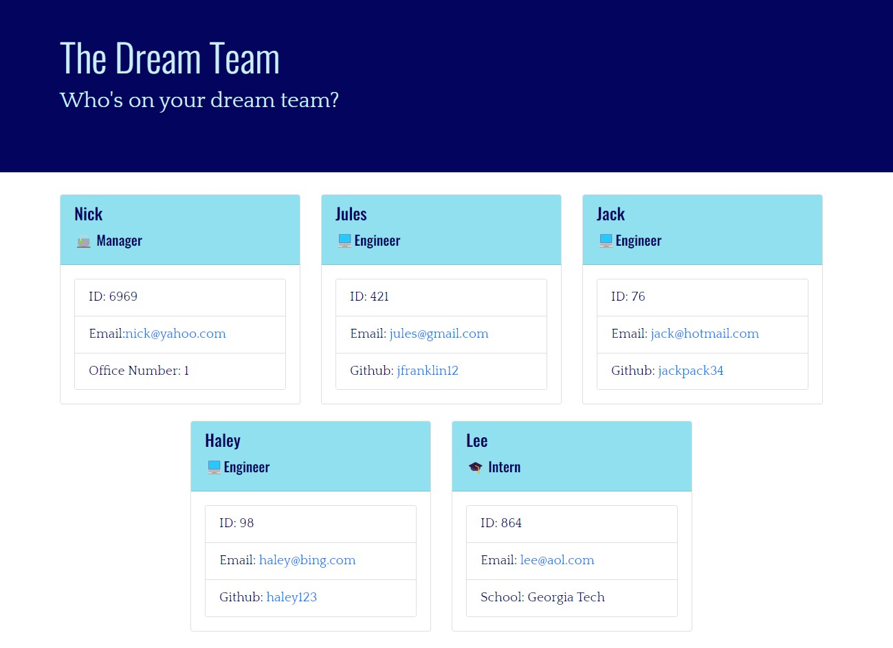
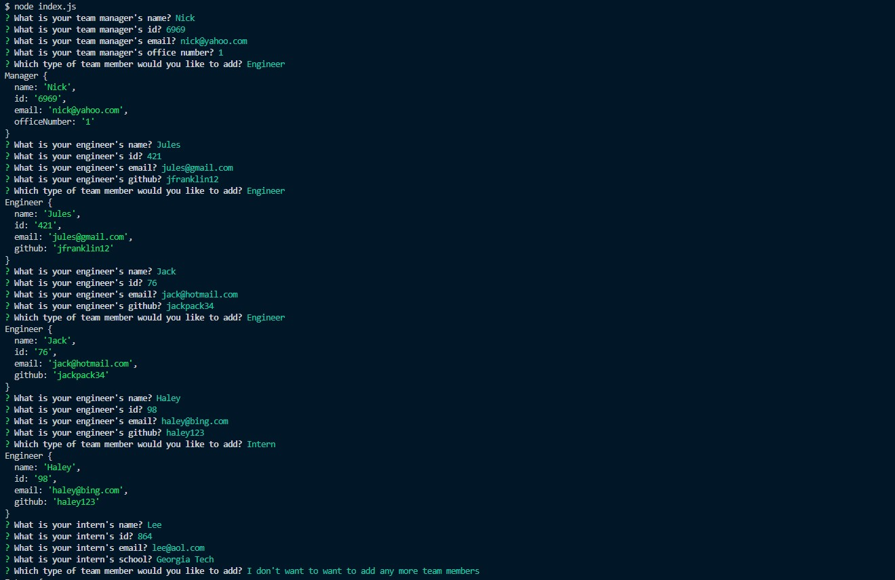
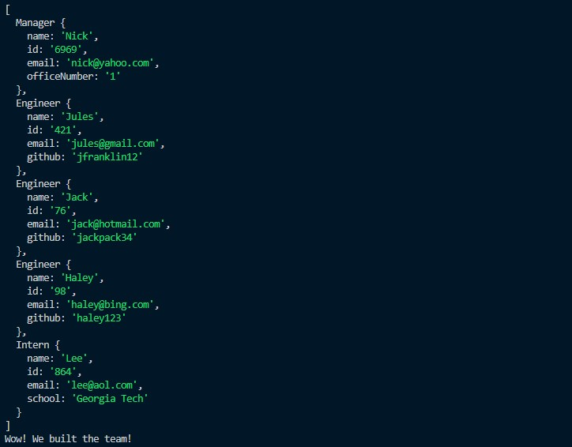

# Julian-Franklin-Team-Profile-Generator
    

  ## Description
  
  Use this application to insert information in the command line of your terminal regarding your employee team, and see it generated in an HTML!

  

  

  

  Use the link below to access a video of how to use the application.

  [Video of HTML Team Profile Generator](https://drive.google.com/file/d/1qH84G3UVlhsRqG_EC-cIV7gSHI87lK4B/view?usp=sharing)

  ## Table of Content
  - [Installation](#installation)
  - [Usage](#usage)
  - [Contributing](#contributing)
  - [Tests](#tests)
  - [Questions](#questions)
  - [License](#license)

  ## Installation

  To install all dependencies run ```npm i``` in the terminal.

  ## Usage

  After following installation instructions, run ```node index.js``` to start the terminal to input information about your employees.

  ## Contributing

  This project is not accepting contributions.

  ## Tests
  
  To run tests enter run ```npm test``` in the command line.

  ## Questions

  If you have any questions, contact me at j.franks725@gmail.com. Visit my GitHub page at [jfranklin12](https://github.com/jfranklin12/) to see my other projects.

  ## Liscence
    
  This projected is licensed under MIT.

  https://opensource.org/licenses/MIT